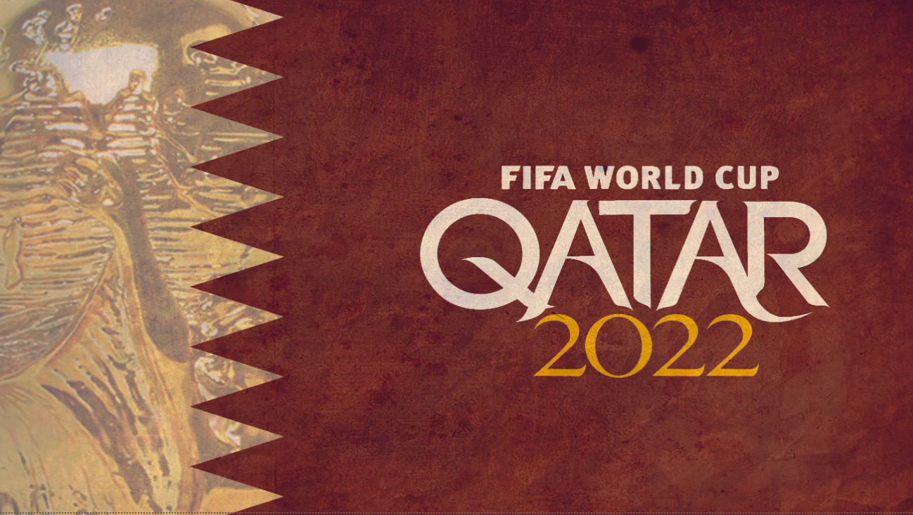
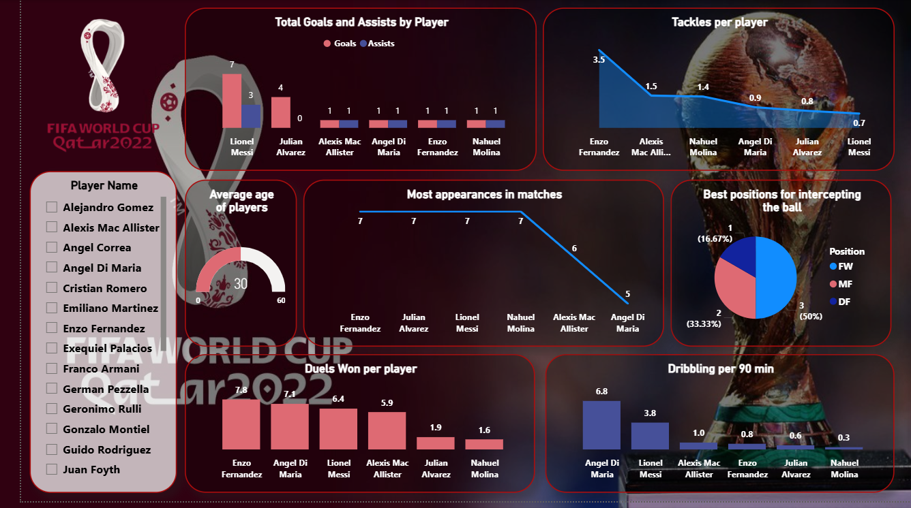
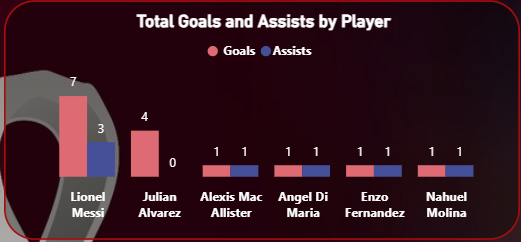
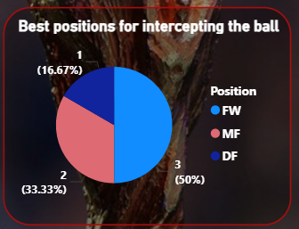
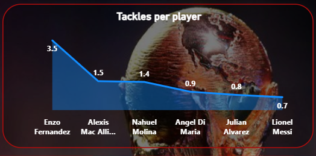
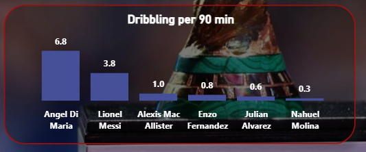
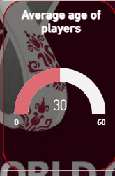
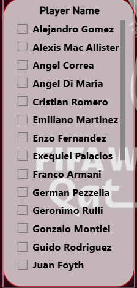

# FIFA-World-Cup-Qatar-2022-Dashboard ⚽🏆
Power BI Dashboard for FIFA World Cup Qatar 2022 analysis and visualizations

تحليل تفاعلي شامل لبيانات كأس العالم 2022 في قطر باستخدام **Power BI**.

## المميزات الرئيسية
- **أهداف وأسيست** لأبرز اللاعبين (مثل ميسي، جوليان ألفاريز، دي ماريا...)
- **تاكلز، دريبلينج، دويلز** won per player
- **أفضل مراكز** للإنترسبت (Intercepting the ball)
- **متوسط أعمار** اللاعبين
- **أكثر اللاعبين ظهورًا** في المباريات
- فلاتر تفاعلية للاعبين والمنتخبات

## الـ Visuals اللي موجودة في الداشبورد
- Column charts للأهداف + الأسيست

- Area charts للتاكلز والظهور

- Pie chart لتوزيع الإنترسبت حسب المركز (FW, MF, DF)

- line أكثر المشاركات في المباريات

- Column charts الدريبلينج

- Gauge لمتوسط العمر

- Slicer لاختيار اللاعبين

## البيانات المستخدمة
- مصدر البيانات: FIFA World Cup 2022 datasets من Kaggle   

- تم تنظيف وتحويل البيانات باستخدام **Power Query**
- حسابات DAX للـ measures (مثل Avg Age, Duels Won per player, Dribbling per 90 min...)

## كيف تشغل الداشبورد؟
1. حمل ملف **FIFA World Cup Qatar 2022.pbix**.
2. افتحه في **Power BI Desktop** .

## الملفات الرئيسية في الريبو
- `FIFA World Cup Qatar 2022.pbix` → ملف الداشبورد الرئيسي
- `dashboard-screenshot.png`

## أدوات مستخدمة
- **Power BI Desktop** (للتصميم والـ visuals)
- **DAX** للحسابات المتقدمة
- **Power Query** لتنظيف البيانات
- Theme داكن مع ألوان كأس العالم (أحمر، أزرق، ذهبي)

**شكرًا للزيارة!**  
صنع بواسطة: AbdelRahman  
تاريخ: 2026
